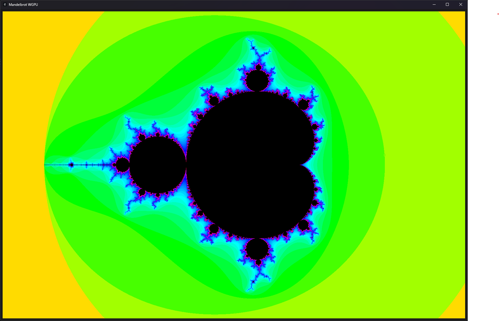
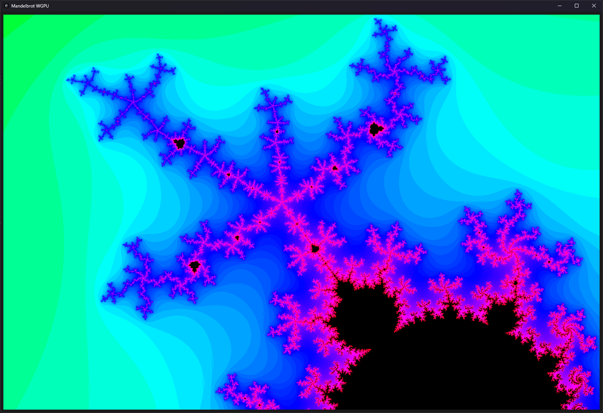
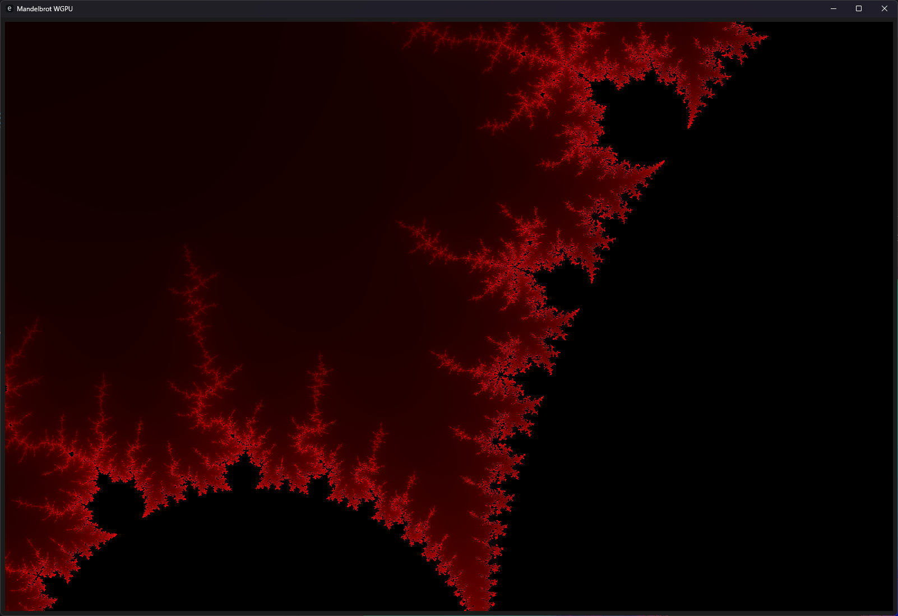
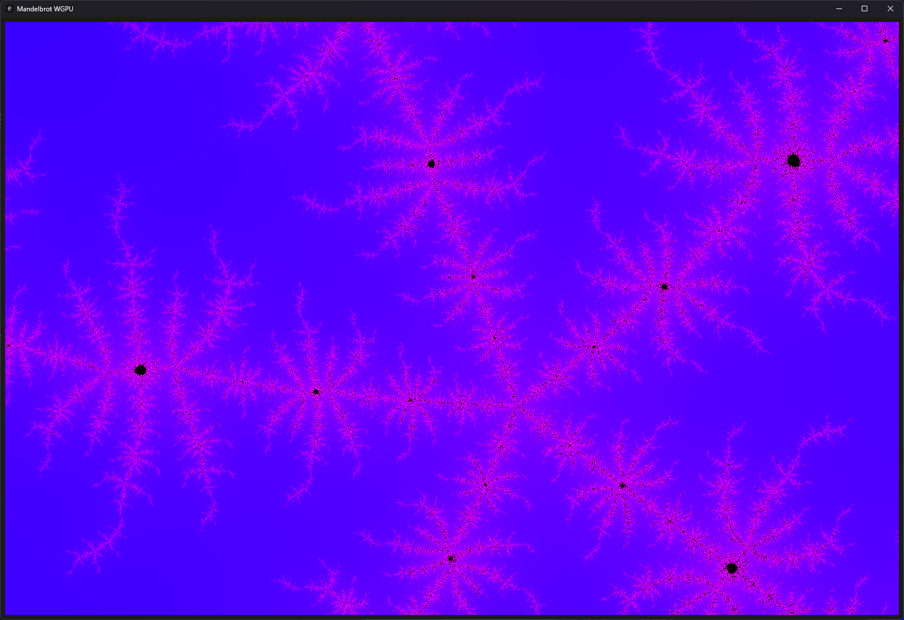

# Mandelbrot set with GPU (wgpu) rendering

This is interactive app for rendering Mandelbrot set with GPU.

## Controls

F1 - Toggle settings

F11 - Fullscreen

Mouse scroll - Zoom

Primary mouse button + move - change coordinates

Secondary mouse button + move - change initial value

## Screenshots






## Build from source

1) [Install rust](https://www.rust-lang.org/tools/install)
2)

```bash
cargo b -r 
```

Output binary file is `target/release/mandelbrot_gpu.exe`